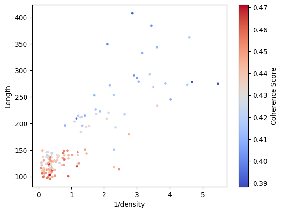

# Analysis and Classification of Research Papers

This repository focuses on analyzing and classifying research papers based on their content. It involves two main tasks:

1. **Publishability Classification**: Determines whether a research paper is suitable for publication based on extracted features.
2. **Conference Suitability Classification**: Predicts the best conference for a research paper using K-Nearest Neighbors (KNN) on embedded abstracts.

---

## Table of Contents

- [Overview](#overview)
- [Methodology](#methodology)
- [Feature Extraction & Visualization](#feature-extraction--visualization)
- [Conference Classification](#conference-classification)
- [Performance Metrics](#performance-metrics)
- [Installation](#installation)
- [Usage](#usage)
- [License](#license)

---

## Overview

The goal of this project is to assist researchers in determining:
- If their paper is **publishable** or not.
- Which **conference** their paper is best suited for.

The classification is done by leveraging feature extraction, visualization, and machine learning techniques.

---

## Methodology

### **1. Publishability Classification**
- Extract useful features from the paper's text.
- Visualize the extracted features using a **scatter plot** to observe the decision boundaries.
- Apply classification techniques to determine if the paper is publishable.

### **2. Conference Suitability Classification**
- Embed the abstract of the given research paper.
- Perform **K-Nearest Neighbors (KNN)** using training paper titles collected from various conferences.
- Predict the most suitable conference for submission.

---

## Feature Extraction & Visualization

The following features are extracted to assess the **publishability** of a research paper:
- Average length of sentences
- Density of mathematical characters
- Average Sentence Coherence (how related each word in a sentence is to others)

A scatter plot is used to visualize these features:



---

## Conference Classification

For conference classification:
- The abstract is converted into an **embedding**.
- **KNN is used** with pre-labeled training data (conference-specific research paper titles).
- The nearest neighbors in **cosine similarity** help determine the best-suited conference.

---

## Performance Metrics

### Publishability Classifier

The train data for clustering had 150 papers all of with were used to extract features to create the scatter plot.
The test data consisted of a small 15 paper, 5 are non-publishable, 10 are publishable.

Confusion matirx:  

|      | Actual Positive | Actual Negative |
|--------|----------|------------|
| Predicted Positive | 10 | 0 | 
| Prediced Negative | 0 | 5 | 
  
Precision = 1  
Recall = 1  
F1 Score = 1 

### Conference Classifier

The test data consisted of 10 research papers which belonged to 5 classes. In this small dataset out model shows 90% accuracy, only misclassifying 1 of the research papers. This might because the predicted class and the actual class had very similar topics and the boundary is not clear.

## Installation

To set up the project, follow these steps:

```sh
# Clone the repository
git clone https://github.com/Pramoth-Raj/Projects

# Navigate to the project directory
cd Projects/Research_paper_analysis

# Install dependencies
pip install -r Research_paper_analysis/requirements.txt
```

## Usage

Replace your pdf file path and Groq API key in the main.py file before running.

## License

This project is licensed under the MIT License.


